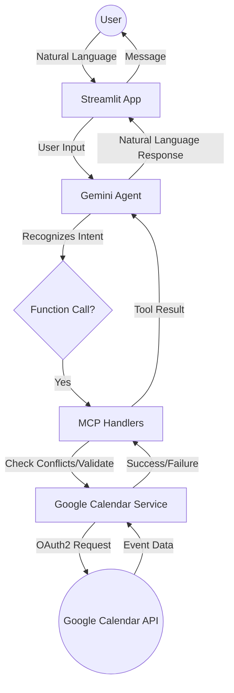

# 📅 Calendar Agent (Gemini + Google Calendar)

An AI-powered calendar assistant that uses **Google Gemini 2.0 Flash** and the **Model Context Protocol (MCP)** to manage your Google Calendar through natural language.

---

## 🌟 Overview (For Everyone)

Imagine having a personal assistant who lives in your chat box. You can tell them:
* *"Schedule a meeting with John tomorrow at 3 PM about the project review."*
* *"What do I have planned for next Tuesday?"*
* *"Move my coffee chat with Sarah to Friday morning."*

This project makes that possible. It connects a powerful AI (Google Gemini) directly to your Google Calendar. Instead of clicking through menus and filling out forms, you just talk to the agent in plain English, and it handles the technical details of creating, updating, or deleting your events.

### Key Benefits:
* **Natural Talk**: No need to learn special commands.
* **Smart Conflict Detection**: The agent warns you if you're trying to book two things at the same time.
* **Automatic Sync**: Everything happens directly in your real Google Calendar.
* **Google Meet Ready**: It can automatically add video call links to your meetings.

---

## 🛠️ Technical Architecture (For Developers)

This project is built using a modular architecture that separates the user interface, the AI logic, and the data integration.

### Component Breakdown

1.  **Frontend (Streamlit)**: A web-based UI that handles user input and displays the conversation history. It interacts with the `CalendarAgent`.
2.  **AI Agent (Google Gemini)**: Uses `gemini-2.0-flash` with **Function Calling** capabilities. It interprets user intent and decides which "tools" to use.
3.  **MCP Server**: Implements the Model Context Protocol. It acts as a standardized bridge between the AI and the underlying calendar logic.
4.  **Tool Handlers**: Python logic that validates dates, times, and checks for conflicts before calling the Google API.
5.  **Integration Layer**: Communicates directly with the **Google Calendar API** using OAuth2 for secure access.

### 🔄 Data Flow



### 🌐 Network & Security Flow

1.  **Authentication (OAuth2)**:
    *   The app uses the `InstalledAppFlow` to request permission from your Google Account.
    *   It securely stores a `token.json` file locally (encrypted by Google's client library).
    *   Communication with Google APIs happens over HTTPS.
2.  **AI Communication**:
    *   User text is sent to Google's Gemini API.
    *   The API returns instructions (function calls) which are executed locally on your machine.
    *   **Privacy Note**: Only the calendar data required to answer your specific query is shared with the AI model.

---

## 🚀 Getting Started

### Prerequisites
* Python 3.10+
* A Google Cloud Project with the **Google Calendar API** enabled.
* A `credentials.json` file from the Google Cloud Console.

### Setup Instructions

1.  **Clone the Repository**:
    ```bash
    git clone <repository-url>
    cd calendar_agent_mcp
    ```

2.  **Install Dependencies**:
    ```bash
    pip install -r requirements.txt
    ```

3.  **Configure Environment**:
    *   Copy `.env.example` to `.env`.
    *   Add your `GOOGLE_API_KEY` (for Gemini).

4.  **Google Auth Setup**:
    *   Place `credentials.json` in the `credentials/` folder.
    *   Run the setup script:
        ```bash
        python setup_google_auth.py
        ```
    *   Follow the browser prompt to authorize the app.

5.  **Run the Application**:
    ```bash
    streamlit run app.py
    ```

---

## 📂 Project Structure

* `app.py`: Main entry point (Streamlit UI).
* `agent/`: Contains `calendar_agent.py` (LLM integration).
* `mcp_server/`: MCP server implementation and tool definitions.
* `integrations/`: Google Calendar API service logic.
* `config/`: Configuration settings for MCP and Google API.
* `utils/`: Helper functions for date/time parsing.
* `credentials/`: Storage for your API secrets.
